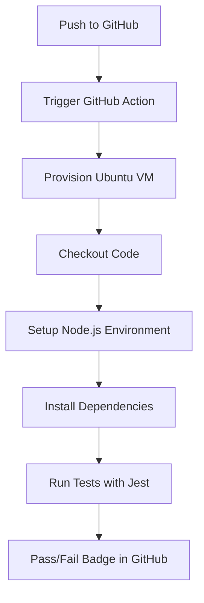

# GitHub Actions for Node.js App

This project demonstrates how to use GitHub Actions for CI/CD automation.



## Features

- Simple Node.js greeting app
- Unit testing with Jest
- CI workflow: install, test, and validate

## GitHub Actions Workflow

- Trigger: Push or PR to `main`
- Steps:
  - Checkout repo
  - Install Node
  - Install dependencies
  - Run tests

## How to Run Locally

```bash
npm install
npm test
```
